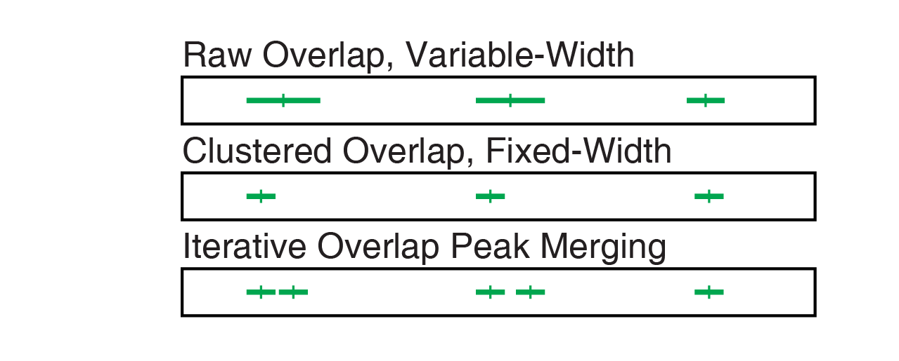

## Introduction

This vignette will demonstrate how to combine separate datasets containing
single-cell chromatin data. This is a common task that arises in cases when:

- You have too many cells to fit into a single lane of the 10x chip.
- You produce libraries on multiple days.
- You want to integrate your data with public datasets (to increase statistical 
  power or improve cell type annotations).  

## References

This vignette is a based on [this](https://satijalab.org/signac/articles/integrate_atac.html) 
and [this](https://satijalab.org/signac/articles/merging.html) vignettes for 
the Signac package with some explanations borrowed from the
[ArchR documentation](https://www.archrproject.com/bookdown/).

## Load required R libraries

Before we start with any analysis, it is good practice to load all
required libraries. This will also immediately identify libraries that
may be missing. Note that for this course, we pre-installed all
libraries for you. When you run your own analysis, you have to check
which libraries are already available, and which are not. We use
`suppressPackageStartupMessages` here to suppress the output messages of
the various packages for reasons of brevity.

In order to control the computing resource allocation we will explicitly
load the `future` package and set the required parameters.

When using functions that sample pseudorandom numbers, each time you
execute them you will obtain a different result. For the purpose of this
vignette, this is not what we want. We therefore set a particular seed
value(here: 1990) so that the result will always be the same. For more
information, check out [this webpage](https://r-coder.com/set-seed-r)
that explains this general concept in more detail.


```{r lib, eval=TRUE}

suppressPackageStartupMessages({
library(Seurat)
library(Signac)
library(tidyverse)
library(GenomicRanges)
library(future)
})

# parallelization parameters
plan("multisession", workers = 8) # number of parallel workers for functions that support it
options(future.globals.maxSize = 40000 * 1024^2) # RAM limit of 40 Gb

set.seed(1990)
```

## Create Seurat object from multiple datasets

### Create consensus peak set

When merging multiple single-cell chromatin datasets, it’s important to be
aware that if peak calling was performed on each dataset independently, the 
peaks are unlikely to be exactly the same. We therefore need to create a 
common set of peaks across all the datasets to be merged.

There are multiple ways to combine different peak sets with different pros 
and cons. Here is a couple of options:

-   **Raw peak overlap**: Raw peak overlap involves taking any peaks that 
                          overlap each other and merging these into a single 
                          larger peak. In this scheme, daisy-chaining can
                          become a problem because peaks that don't directly
                          overlap each other get included in the same larger
                          peak because they are bridged by a shared internal
                          peak. Another problem with this type of approach is
                          that, if you want to keep track of peak summits, 
                          you are forced to either pick a single new summit 
                          for each new merged peak or keep track of all of 
                          the summits that apply to each new merged peak.


-   **Clustered Overlap**: Clustered overlap takes peaks that cluster together 
                           and picks a single winner. This is done by keeping 
                           the most significant peak in each cluster. This may 
                           end up under-calling peaks and missing smaller peaks
                           located nearby.


-   **Iterative Overlap**: [Iterative overlap removal](https://www.science.org/doi/10.1126/science.aav1898)
                             is the method used 
                             in the
                             [ArchR](https://www.archrproject.com/bookdown/the-iterative-overlap-peak-merging-procedure.html) 
                             package. It avoids the issues 
                             mentioned above. Peaks are first ranked by their 
                             significance. The most significant peak is 
                             retained and any peak that directly overlaps with 
                             the most significant peak is removed from further
                             analysis. Then, of the remaining peaks, this 
                             process is repeated until no more peaks exist.
                             This avoids daisy-chaining and still allows for 
                             use of fixed-width peaks.


Here is the comparisons of results of all 3 methods for the peaks from above.



They all produce distinct sets of peaks, and the **Iterative Overlap** is
argued by the authors of ArchR to be the most optimal. However in our analysis
we will stick with the **Raw Overlap** method for the sake of simplicity and
because it is still widely used. 


To create a unified set of peaks we can use functions from the `GenomicRanges`
package. The `reduce` function from `GenomicRanges` will merge all intersecting 
peaks.


```{r readPeaks}
# Make sure to have a trailing slash here
outFolder="/home/max/Work/EMBL/PROJECTS/atac-seq_course_2022/data/"
sample1Folder = paste0(outFolder, "samples/Subsample01Seed1/")
sample2Folder = paste0(outFolder, "samples/Subsample01Seed2/")
sample3Folder = paste0(outFolder, "samples/Subsample01Seed3/")


# read BED files containing sample-specific peaks as a data.frame
peaks.1 = read.table(
  file = paste0(sample1Folder, "peaks.bed"),
  skip = 52,
  col.names = c("chr", "start", "end")
)
peaks.2 = read.table(
  file = paste0(sample2Folder, "peaks.bed"), 
  skip = 52,
  col.names = c("chr", "start", "end")
)
peaks.3 = read.table(
  file = paste0(sample3Folder, "peaks.bed"), 
  skip = 52,
  col.names = c("chr", "start", "end")
)

head(peaks.1)
```

Now we can use these data.frames to create `GenomicRanges` objects for 
each peak set.

```{r convertPeaks}
# convert data frames to GenomicRanges
gr.1 = makeGRangesFromDataFrame(peaks.1)
gr.2 = makeGRangesFromDataFrame(peaks.2)
gr.3 = makeGRangesFromDataFrame(peaks.3)

rm(peaks.1, peaks.2, peaks.3)

gr.1
```

Now we can combine the ranges into a single peak set.

```{r reducePeaks}
# Create a unified set of peaks to quantify in each dataset
combined.peaks = reduce(x = c(gr.1, gr.2, gr.3))
```

If you are concerned about potential drawbacks of using **Raw Overlap** 
peak merging strategy, we can check how it affects the distribution of peak
widths.

```{r peakWidths}
peak_widths = rbind(
  tibble(PeakWidth = width(combined.peaks), PeakSet="Combined"),
  tibble(PeakWidth = width(gr.1), PeakSet="Sample1"),
  tibble(PeakWidth = width(gr.2), PeakSet="Sample2"),
  tibble(PeakWidth = width(gr.3), PeakSet="Sample3")
  )

ggplot(data = peak_widths, aes(x = PeakWidth, col = PeakSet))+
  geom_density()+
  ggtitle("Distribution of peak widths in each sample and in consensus peak set")

```

We can see that Combined peak set has consistently broader peaks, which is
expected from the way smaller sample-specific peaks are merged into one 
bigger peak. The density distribution may not be indicative of the rare
extreme events (narrowest and widest peaks), so we may want to check manually
the top and bottom of the distribution.

```{r sliceMax}
peak_widths %>% 
  group_by(PeakSet) %>% 
  slice_max(n=10, order_by=PeakWidth) %>%
  mutate(rank = 1:10) %>% 
  pivot_wider(names_from = PeakSet, values_from = PeakWidth, id_cols = rank)

```

```{r sliceMin}
peak_widths %>% 
  group_by(PeakSet) %>% 
  slice_min(n=10, order_by=PeakWidth) %>%
  mutate(rank = 1:10) %>% 
  pivot_wider(names_from = PeakSet, values_from = PeakWidth, id_cols = rank)
```

If there are any anomalous peaks that arise from the merging we can filter
them out. Additionally we can remove all non-standard chromosomes. 

```{r filterPeaks}
# Filter out bad peaks based on length
peakwidths = width(combined.peaks)
combined.peaks = combined.peaks[peakwidths  < 10000 & peakwidths > 20]

# might as well filter out non-standard chromosomes
seqlevels(combined.peaks, pruning.mode="coarse") = standardChromosomes(combined.peaks)

combined.peaks
```

### Create Fragment objects

To quantify our combined set of peaks we’ll need to create a `Fragment` object
for each experiment. The `Fragment` class is a specialized class defined in 
Signac to hold all the information related to a single fragment file.

#### Reading and filtering the cell/barcode metadata

First we’ll load the cell metadata for each experiment so that we know 
what cell barcodes are contained in each file

```{r loadMeta}
# load metadata
md.1 = read.table(
  file = paste0(sample1Folder, "singlecell.csv"),
  stringsAsFactors = FALSE,
  sep = ",",
  header = TRUE,
  row.names = 1
)[-1, ] # remove the first row

md.2 = read.table(
  file = paste0(sample2Folder, "singlecell.csv"),
  stringsAsFactors = FALSE,
  sep = ",",
  header = TRUE,
  row.names = 1
)[-1, ] # remove the first row

md.3 = read.table(
  file = paste0(sample3Folder, "singlecell.csv"),
  stringsAsFactors = FALSE,
  sep = ",",
  header = TRUE,
  row.names = 1
)[-1, ] # remove the first row
```

Now we can filter out non-cells and low quality cells. `singlecell.csv` 
metadata file already has quite a lot of QC information similar to what 
you produced in the `QClustering` vignette. You can check all of the options 
available 
[here](https://support.10xgenomics.com/single-cell-atac/software/pipelines/latest/output/singlecell),
but for simplicity we will just use 2 of the available parameters:

- **is_cell_barcode**: binary indicator of whether barcode is associated with
                       a cell according to cellranger's automated cell 
                       calling algorithm.
- **passed_filters**: number of non-duplicate, usable read-pairs 
                      i.e. "fragments".
                       
```{r filterMetaNaive}
# perform an initial filtering of low count cells and non-cells
md.1 = md.1[as.logical(md.1$is__cell_barcode) & (md.1$passed_filters > 1000), ]
md.2 = md.2[as.logical(md.2$is__cell_barcode) & (md.2$passed_filters > 1000), ]
md.3 = md.3[as.logical(md.3$is__cell_barcode) & (md.3$passed_filters > 1000), ]
# As a side note. The cellranger-atac version 2.0 that we ran during testing 
# produced a singlecell.csv file with the `is__cell_barcode` column spelled with
# a double underscore. This is probably an innocent bug, that would be fixed
# in later versions.  
```

Alternatively to the last step we could have used the Seurat objects that you
have created already in the `QClustering` vignette to extract high quality
cells since it involved more thorough quality controls:

```{r filterMetaSeurat, eval=FALSE}
# read the cell names from the filtered seurat objects
cells_from_seurat_sample1 = readRDS(file = paste0(sample1Folder, "obj.filt.rds")) %>%  colnames()
cells_from_seurat_sample2 = readRDS(file = paste0(sample2Folder, "obj.filt.rds")) %>%  colnames()
cells_from_seurat_sample3 = readRDS(file = paste0(sample3Folder, "obj.filt.rds")) %>%  colnames()

md.1 = md.1[cells_from_seurat_sample1, ]
md.2 = md.2[cells_from_seurat_sample2, ]
md.3 = md.3[cells_from_seurat_sample3, ]
```


#### Creating the fragment objects

Now we can create `Fragment` objects using the `CreateFragmentObject` 
function. The `CreateFragmentObject`
function performs some checks to ensure that the file is present on disk and
that it is compressed and indexed, computes the MD5 sum for the file and the
tabix index so that we can tell if the file is modified at any point, and 
checks that the expected cells are present in the file.

```{r createFragment}
frags.1 = CreateFragmentObject(
  path = paste0(sample1Folder, "fragments.tsv.gz"),
  cells = rownames(md.1)
)
frags.2 = CreateFragmentObject(
  path = paste0(sample2Folder, "fragments.tsv.gz"),
  cells = rownames(md.2)
)
frags.3 = CreateFragmentObject(
  path = paste0(sample3Folder, "fragments.tsv.gz"),
  cells = rownames(md.3)
)

```


### Quantify peaks in each dataset

We can now create a matrix of peaks x cell for each sample using the 
`FeatureMatrix` function. This function is parallelized using the
`future` package.

```{r countFeatures}
sample1.counts = FeatureMatrix(
  fragments = frags.1,
  features = combined.peaks,
  cells = rownames(md.1)
)
sample2.counts = FeatureMatrix(
  fragments = frags.2,
  features = combined.peaks,
  cells = rownames(md.2)
)
sample3.counts = FeatureMatrix(
  fragments = frags.3,
  features = combined.peaks,
  cells = rownames(md.3)
)
```

### Create Seurat objects

We will now use the quantified matrices to create a Seurat object for each 
dataset, storing the Fragment object for each dataset in the assay.

```{r createObjects}
# First we create a ChromatinAssay object
sample1_assay = CreateChromatinAssay(
  sample1.counts, 
  fragments = frags.1
)
# Then we create a Seurat object based on this ChromatinAssay
sample1 = CreateSeuratObject(
  sample1_assay, 
  assay = "ATAC", 
  project = "mouse_ES_LIF", 
  meta.data=md.1
)

# First we create a ChromatinAssay object
sample2_assay = CreateChromatinAssay(
  sample2.counts,
  fragments = frags.2
)
# Then we create a Seurat object based on this ChromatinAssay
sample2 = CreateSeuratObject(
  sample2_assay, 
  assay = "ATAC",
  project = "mouse_ES_LIF",
  meta.data=md.2
)

# First we create a ChromatinAssay object
sample3_assay = CreateChromatinAssay(
  sample3.counts,
  fragments = frags.3
)
# Then we create a Seurat object based on this ChromatinAssay
sample3 = CreateSeuratObject(
  sample3_assay,
  assay = "ATAC",
  project = "mouse_ES_LIF",
  meta.data=md.3
)

```

###  Merge Seurat objects

Now that the objects each contain an assay with the same set of features, 
we can use the standard `merge` function to merge the objects. This will 
also merge all the fragment objects so that we retain the fragment 
information for each cell in the final merged object.

```{r mergeObjects}
# add information to identify dataset of origin
sample1$dataset = 'sample1'
sample2$dataset = 'sample2'
sample3$dataset = 'sample3'


# merge all datasets, adding a cell ID to make sure cell names are unique
combined = merge(
  x = sample1,
  y = list(sample2, sample3),
  add.cell.ids = c("1", "2", "3")
)

#Since we renamed corresponding cells in the combined object we should also rename them in separate ones.
sample1 = RenameCells(sample1, add.cell.id = "1")
sample2 = RenameCells(sample2, add.cell.id = "2")
sample3 = RenameCells(sample3, add.cell.id = "3")


combined
```

## Validate our integration

We finally have our combined object. Now we can perform standard
pre-processing, keeping track of each cell's dataset of origin. We can 
check for any batch effects visually on a UMAP plot.

```{r preProcess}
# Perform variable feature selection, data normalization, PCA and
# UMAP embedding into a 2D space.
combined = FindTopFeatures(combined, min.cutoff = 20)
combined = RunTFIDF(combined)
combined = RunSVD(combined)
combined = RunUMAP(combined, dims = 2:50, reduction = 'lsi', verbose = F)

# Plot the resulting UMAP colored by the original dataset of each cell.
DimPlot(combined, group.by = 'dataset', pt.size = 0.5)
```

The merged object contains all fragment objects, and contains an 
internal mapping of cell names in the object to the cell names in each 
fragment file so that we can retrieve information from the files without 
having to change the cell names in each fragment file. We can check that 
functions that pull data from the fragment files work as expected on the
merged object by plotting a region of the genome. Here we can can also check
for any significant differences between datasets/batches, although it may 
depend heavily on the genomice region in question.

```{r covPlot}
CoveragePlot(
  object = combined,
  group.by = 'dataset',
  region = "chr1-19230000-19240000"
)
```

Depending on the results of this section we may or may not need to perform 
further steps in order to mitigate any systematic batch effects between
your samples. Whether or not this is needed you can gauge by how much
sample dependent clustering is present in your merged object. If the cells
from different datasets are more or less evenly distributed across your UMAP
plot you can assume that there is no major batch effect that needs correcting.
If the cells cluster primarily based on the dataset or within each cell 
type-specific cluster they further subcluster based on the initial dataset
you probably need to correct this dataset-specific variation in order to avoid
any downstream  artefacts stemming from this dataset-specific variation.

**P.S.**: One special case you need to keep in mind in your analyses is 
when you observe a cluster that fully or mostly corresponds to one dataset, 
but you don't observe similar imbalance in other clusters. This may
correspond to a batch effect, but in many cases it can represent genuine
heterogeneity in cell type composition between your datasets. 

## Integration

If you are following this part of the vignette it means that you found
significant evidence for a batch effect between the datasets you were 
integrating in the previous steps.

We will integrate your datasets, using tools available in the Seurat package.
This method is based on identifying so-called **mutual nearest neighbors** 
([Haghverdi et al., 2018](https://www.nature.com/articles/nbt.4091)) or
**anchors** 
([Stuart, Butler, et al., 2019](https://www.cell.com/cell/fulltext/S0092-8674(19)30559-8)).
These are pairs of cells from different datasets that correspond to the same
or similar cell state. Once you have this set of **anchors** you can find a 
transformation that would project these anchors from dataset 1 into the
space of the dataset 2 while minimising the distance between the projection
it's corresponding anchor in dataset 2.

Following figure from 
[Haghverdi et al., 2018](https://www.nature.com/articles/nbt.4091)
illustrates the general idea behind the approach.


### Perform LSI embedding on separate datasets

Rather than integrating the normalized data matrix, as is typically done
for scRNA-seq data, we'll integrate the low-dimensional cell embeddings
(the LSI coordinates) across the datasets using the `IntegrateEmbeddings` 
function. This is much better suited to scATAC-seq data, as we typically 
have a very sparse matrix with a large number of features. Note that this 
requires that we first compute an uncorrected LSI embedding using the
merged dataset (as we did above).

```{r sampleLSE}
sample1 = FindTopFeatures(sample1, min.cutoff = 20) 
sample1 = RunTFIDF(sample1)
sample1 = RunSVD(sample1)


sample2 = FindTopFeatures(sample2, min.cutoff = 20) 
sample2 = RunTFIDF(sample2)
sample2 = RunSVD(sample2)

sample3 = FindTopFeatures(sample3, min.cutoff = 20) 
sample3 = RunTFIDF(sample3)
sample3 = RunSVD(sample3)

```

### Identify integration anchors

To find integration anchors between the two datasets, we need to project them 
into a shared low-dimensional space. To do this, we'll use reciprocal LSI
projection (projecting each dataset into the others LSI space) by 
setting `reduction="rlsi"`.

```{r findAnchors}
# find integration anchors
integration.anchors = FindIntegrationAnchors(
  object.list = list(sample1, sample2, sample3),
  anchor.features = rownames(sample1),
  reduction = "rlsi",
  dims = 2:30,
  verbose = F
)
```

### Integrate datasest

```{r integrateAnchors}
# integrate LSI embeddings
integrated = IntegrateEmbeddings(
  anchorset = integration.anchors,
  reductions = combined[["lsi"]],
  new.reduction.name = "integrated_lsi",
  dims.to.integrate = 1:30,
  verbose = F
)
```

### Check integration results

Now that we have our final integration in the LSI space we can make another
UMAP plot to see whether is was successful. 

```{r checkIntegration}
# create a new UMAP using the integrated embeddings
integrated = RunUMAP(integrated, reduction = "integrated_lsi", dims = 2:30, verbose = F)
DimPlot(integrated, group.by = "dataset")
```

Hopefully now all the samples are well integrated.

**P.S.**: The method we presented here is not the only one that can correct 
batch effects in single cell data. But one needs to pay attention when applying 
these tools to whether they were designed to work specifically with scRNA data.
In case of the **anchor** based integration the method can be easily extended 
for use with scATAC data, but even in this case some adjustments were required.
As was mentioned above partly due to extreme sparsity of the data we had 
to use reciprocal LSI for anchor identification instead of 
Canonical Correlation Analysis which is the original approach described for 
scRNA data. Another popular tool for data integration is 
[Harmony](https://www.nature.com/articles/s41592-019-0619-0), which is the 
default approach for dealing with batch effects when using
[ArchR](https://www.archrproject.com/bookdown/batch-effect-correction-wtih-harmony.html),
but it can also be used with a Seurat object.

## Session Info

It is good practice to print the so-called session info at the end of an
R script, which prints all loaded libraries, their versions etc. This
can be helpful for reproducibility and recapitulating which package
versions have been used to produce the results obtained above.

```{r sessionInfo}
sessionInfo()
```
